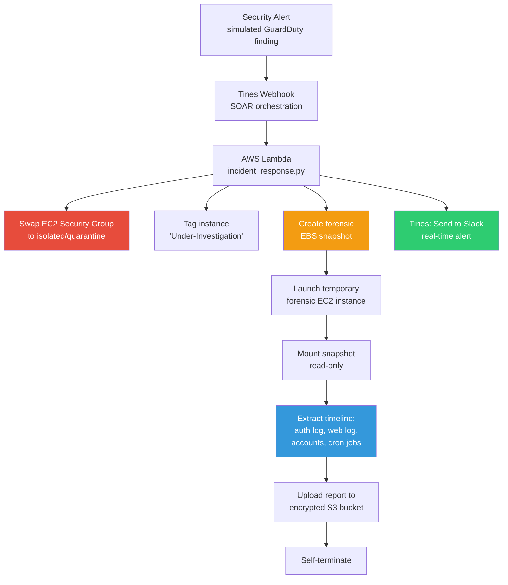

Here you go — copy everything below, starting from `# AegisFlow` down to the very last line. No outer wrapper this time.

# AegisFlow — Automated Cloud Incident Response & Forensic Pipeline

A serverless, event-driven incident response pipeline for AWS. When a security
alert fires (simulating AWS GuardDuty detecting a compromised EC2 instance),
AegisFlow automatically contains the threat, preserves forensic evidence,
extracts a timeline, and notifies the security team — without waiting on
manual triage.

## Architecture



## What it does

1. **Isolation** — swaps the compromised instance's security group to a
   zero-rule quarantine group, cutting off all inbound/outbound network
   access at the cloud control-plane level (an attacker with root on the
   host can't override this).
2. **Evidence collection** — automatically snapshots the instance's root EBS
   volume before any further action is taken, so forensic evidence is
   preserved even if the instance is later terminated.
3. **Forensic timeline** — launches a short-lived, fully isolated EC2
   instance with the snapshot attached as a second volume. It mounts the
   disk read-only, extracts a targeted set of forensic artifacts (auth log,
   web server log, user accounts, cron jobs, bash history), uploads a
   timeline report to an encrypted S3 bucket, and self-terminates.
4. **Notification** — posts a real-time incident summary to Slack via Tines,
   including the instance ID, finding type, and containment action taken.

## Stack

- **Terraform** — infrastructure as code (VPC, security groups, EC2, Lambda, IAM, S3)
- **AWS Lambda (Python / boto3)** — containment, evidence collection, and
  forensic-instance orchestration logic
- **Tines** — SOAR orchestration and Slack notification
- **Least-privilege IAM** — every component (the Lambda, the forensic
  instance) has its own separate IAM role, scoped to only the exact actions
  it needs — no broad `ec2:*`, no shared credentials, no unnecessary access.

## Project structure

```
terraform/
  main.tf        # VPC, subnet, security groups, mock victim EC2 instance
  variables.tf   # Region, project name, instance type, webhook secret
  lambda.tf      # IAM role/policy, Lambda function, public Function URL
  forensic.tf    # S3 bucket, forensic instance IAM role, isolated security group
  outputs.tf     # Instance ID, IPs, security group IDs, function URL, bucket name
lambda/
  incident_response.py   # Containment, snapshot, and forensic-launch logic
```

## Setup

1. `cd terraform && terraform init && terraform apply`
2. Note the outputs (`victim_instance_id`, `victim_public_ip`, security group IDs)
3. Simulate an alert by invoking the Lambda directly, or via a Tines webhook
   wired to the Lambda's Function URL
4. Watch the instance get isolated and a forensic snapshot appear in
   EC2 → Elastic Block Store → Snapshots
5. After ~2-5 minutes, check the forensic timeline:
   ```
   aws s3 ls s3://<your-forensic-bucket-name>/forensic-reports/<instance-id>/
   ```
6. `terraform destroy` when done to avoid ongoing AWS charges

## Why containment, not termination

The pipeline isolates the instance rather than destroying it. This preserves
the ability to investigate further, avoids losing evidence, and keeps a
human in the loop before any destructive action — full auto-termination
without review is a common and risky shortcut in incident response
automation.

## Known limitations / roadmap

- **Trigger is currently simulated** — a production version would wire AWS
  GuardDuty findings through EventBridge to fire this automatically, instead
  of a manual invoke.
- **Memory acquisition is not implemented.** EC2 has no built-in
  hypervisor-level memory-dump API; a production version would need an
  agent (e.g. LiME) pre-installed on protected instances.
- **Forensic extraction targets a fixed checklist of artifacts**, rather
  than running a full disk-timeline tool like Plaso/log2timeline — a
  deliberate scope decision favoring reliability over completeness.
- **No approval-gated auto-termination yet** — planned as an interactive
  Slack/Tines approval step before any destructive action is taken.
